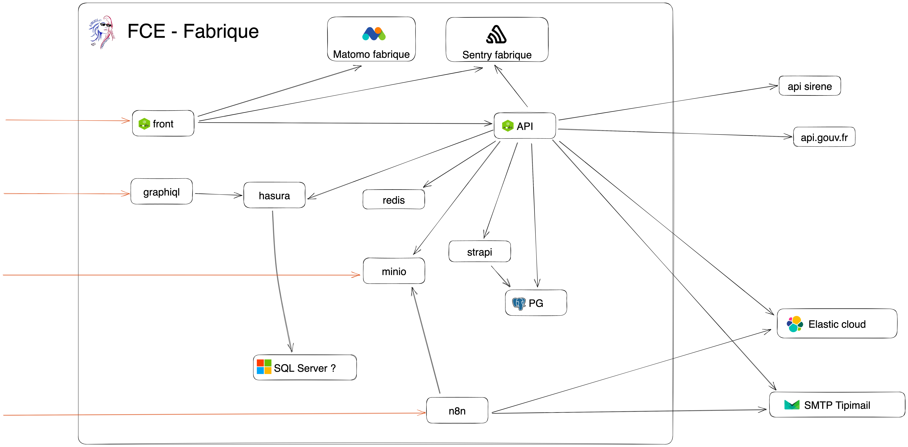
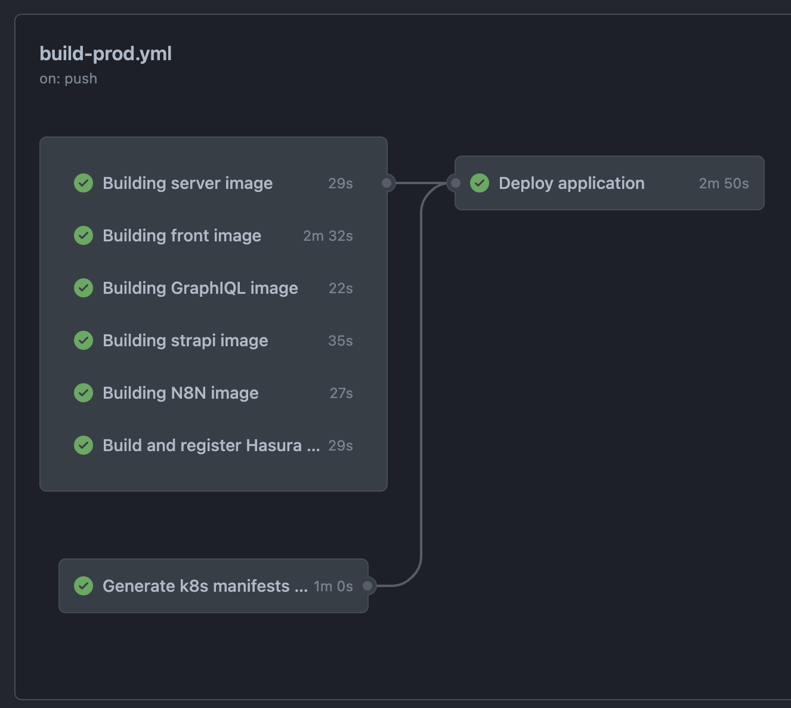

# FCE / DIRECCTE national

- Prod: https://fce.fabrique.social.gouv.fr/
- Repo: https://github.com/socialgouv/fce

## Architecture



| composant     | desc                                     |
| ------------- | ---------------------------------------- |
| front         | react/react-router/webpack               |
| API           | express.js                               |
| minio         | échange de fichiers format S3            |
| elastic cloud | moteur recherche entreprises             |
| n8n           | mise à jour des données de ElasticSearch |
| strapi        | CMS (pages) + gestion du white-listing   |

## Environnements

- un environnement de production
- un environnement par branche de review
- pas de preprod

## Dev Workflow

### En local

il faut utiliser Node@14 et yarn

- lancer les composants infra : `docker-compose up`
- lancer le frontend : `cd src/client && yarn && yarn start`
- dans `src/backend`:
  - copier `.env.dist` en `.env`
  - lancer le serveur : `yarn && yarn watch`
- dans `src/strapi`:
  - copier `.env.dist` en `.env`
  - lancer strapi : `yarn && yarn develop`

A ce moment là vous aurez :

- http://127.0.0.1:3000 : frontend
- http://127.0.0.1:8082 : backend
- http://127.0.0.1:1337 : strapi

### Sur kubernetes

Un environnement de review est déployé pour chaque pull-request via les GitHub actions.

## Déploiement

### semantic-release

Le repo suit les conventions de [semantic-release](https://github.com/semantic-release/semantic-release) :

- Les devs doivent suivre [les conventions de commit de semantic-release](https://github.com/angular/angular/blob/main/CONTRIBUTING.md#-commit-message-format).
- Les releases sont déclenchées au merge sur la branche `master`
- La release déclenche:
  - création d'un changelog + tag GIT
  - build et register des images docker dans la registry GitHub ghcr.io avec le tag en question
  - demande une confirmation manuelle dans GitHub actions puis déploie sur le cluster kubernetes de prod de la fabrique.

### Kubernetes

Le déploiement par environnement est automatisé via les GitHub actions.



Les déploiements sont effectués par [Kontinuous](https://socialgouv.github.io/kontinuous/#/), la solution de CI/CD de la Fabrique Numérique des ministères sociaux.

```shell
npx kontinuous build --open --debug # permet de produire des manifests YAML pour kubernetes.
```

#### Encrypting secrets

Secrets can be encrypted using [webseal](https://socialgouv.github.io/sre-tools)

## Troubleshooting

- **If you get this error `function uuid_generate_v4() does not exist`, run on your db**

```sql
SET search_path TO public;
DROP EXTENSION IF EXISTS "uuid-ossp";

CREATE EXTENSION "uuid-ossp" SCHEMA public;
```
